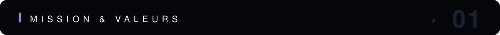
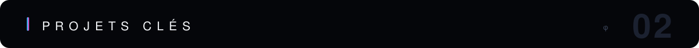
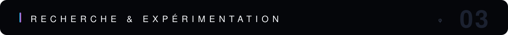
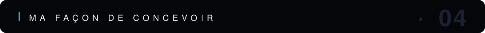
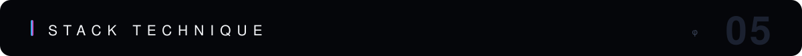
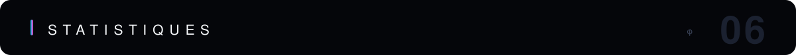
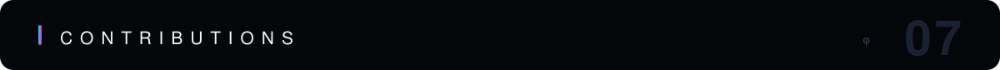
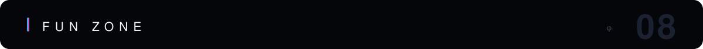
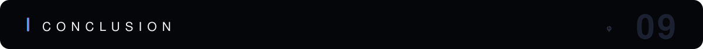

<!-- PROFIL GITHUB DE OUSSAMA FILALI -->
<!-- Bannière : SVG custom généré maison (assets/banner.svg) — spirale de phyllotaxie à l'angle d'or, DA cyan/magenta -->

<p align="center">
  
</p>

<p align="center">
  <a href="https://readme-typing-svg.demolab.com">
    
  </a>
</p>

<p align="center">
  <a href="https://www.linkedin.com/in/oussama-halima-filali-780a32178/"></a>
  <a href="mailto:halimafilalio@gmail.com"></a>
  <a href="http://oussamahalimafilali.online/"></a>
  
</p>



> 💡 **Mission :** Développer des solutions numériques qui facilitent l'accès à l'information et connectent les personnes entre elles.
>
> 🤝 **Valeurs :** Collaboration • Accessibilité • Innovation • Impact Social



> 🔥 Mes projets IA les plus récents, en développement actif.

| Projet | Description | Stack |
|-------|-------------|------|
| 🏭 [**Usine IA Club**](https://github.com/oussama-filali/USINE-IA) — [🌐 usineiaclub.store](http://usineiaclub.store) | Expérience web immersive 3D présentant nos agents d'IA émotionnelle : station spatiale temps réel, scroll narratif, newsletter Supabase + Brevo | `Vite` · `TypeScript` · `React Three Fiber` · `Three.js` · `Tailwind` · `Supabase` |
| 🥗 [**Khayav**](https://github.com/oussama-filali/khayav) | Agent IA **agentique** du Club Usine IA pour restaurants : de la conversation **WhatsApp** à la réservation réelle (Google Calendar), orchestré en graphe d'états | `Python` · `LangGraph` · `n8n` · `WhatsApp Cloud API` · `Docker` |
| 🦖 [**Dino Bot**](https://github.com/oussama-filali/dino-bot) | Compagnon IA conversationnel **sécurisé pour les enfants** : filtre de sujets côté serveur, personnalité adaptée à l'âge, mémoire courte | `FastAPI` · `Python` · `Llama 3.3` · `React` · `Docker` |
| ✍️ [**Linkia Writer**](https://github.com/oussama-filali/linkedin-ai-writer) | Générateur de posts LinkedIn avec fact-checking, prédiction d'engagement & auth OAuth — **app mobile Expo** (expo-router) + API Node | `React Native` · `Expo` · `Node.js` · `Supabase` · `OpenAI` |
| 🃏 [**DINO TCG**](https://github.com/oussama-filali/DINO_TCG) | Jeu de cartes à collectionner fullstack — moteur de duel, decks & factions (MVP fil rouge) | `React` · `TypeScript` · `Express` · `Swagger` |
| [**RafiQ**](https://github.com/oussama-filali/RafiQ) | Plateforme d'entraide locale qui connecte bénévoles et associations | `React` · `Supabase` · `TailwindCSS` |
| [**Match Ton Alternance**](https://github.com/oussama-filali/Match-Ton-Alternance) | Algorithme de matching type Tinder pour étudiants/entreprises | `Python` · `React` · `Supabase` |
| [**DesignEase API**](https://github.com/oussama-filali/designease-api) | Générateur de composants UI pour accélérer le prototypage | `Node.js` · `Express` · `TypeScript` |



| Projet | Description | Stack |
|-------|-------------|------|
| 🌿 [**Langage Harmonique**](https://github.com/oussama-filali/langage-harmonique) | Prototype d'un mini-langage déclaratif (`.harm`) fondé sur le nombre d'or (φ), Fibonacci et l'angle d'or, avec son interpréteur maison : parser, évaluateur d'expressions, événements (`on hover => scale φ`) traduits en animations DOM | `Language Design` · `JavaScript` · `Interpréteur` |



Je ne me contente pas d'assembler des libs — je **conçois** de bout en bout : de la base de données à l'expérience ressentie par l'utilisateur.

- 🗄️ **Conception BDD** — Modélisation Postgres/Supabase pensée pour la prod : tables normalisées, index ciblés, **Row Level Security** et politiques d'accès (ex. articles publics en lecture seule sur *Usine IA Club*).
- 🎨 **Design & UX réelle** — Direction artistique assumée (glassmorphism, palettes cyan/purple, typographie travaillée) et **UX pensée mobile-first** : chargement progressif, éviter l'écran vide, perçu de performance (documenté, pas improvisé).
- 🌌 **3D temps réel** — Scènes **Three.js / React Three Fiber** : modèles GLB, éclairage HDR, environment mapping, systèmes de particules et de liquide custom, optimisations WebGL adaptées à chaque appareil.
- 🤖 **Agents IA connectés au réel** — Pas des chatbots qui parlent, des agents qui **agissent** : orchestration **LangGraph** reliée à **WhatsApp Cloud API**, n8n et Google Calendar (réservations réelles sur *Khayav*), chat FastAPI sécurisé enfants sur *Dino Bot*, fact-checking sur *Linkia Writer*.
- 📱 **Mobile** — Apps **React Native + Expo** (expo-router, config Android soignée : icônes adaptatives, edge-to-edge), itérées en direct sur device via **Expo Go** jusqu'au build Android (`.apk`).
- ⚙️ **Config & déploiement** — Projets **containerisés (Docker)** et déployés en continu (Render), variables d'environnement propres, API REST documentées (Swagger).
- 🔬 **Recherche & réflexion** — Je descends sous les frameworks quand la curiosité l'exige : conception d'un mini-langage et de son interpréteur, expérimentations autour des proportions harmoniques (φ, Fibonacci) appliquées au design.



<p align="center">
  <strong>Langages</strong><br/>
  
  
  
  
</p>

<p align="center">
  <strong>Frontend & 3D</strong><br/>
  
  
  
  
  
  
</p>

<p align="center">
  <strong>Mobile</strong><br/>
  
  
  
</p>

<p align="center">
  <strong>IA & Agents</strong><br/>
  
  
  
  
  
</p>

<p align="center">
  <strong>Backend & DevOps</strong><br/>
  
  
  
  
  
  
  
  
</p>

<p align="center">
  <strong>Outils</strong><br/>
  
  
  
</p>



<!-- Les cartes github-readme-stats (instance publique Vercel) tombaient en 402/503 : retirées.
     Pour les rétablir de façon fiable : self-héberger github-readme-stats sur son propre Vercel. -->
<p align="center">
  
</p>



<p align="center">
  <picture>
    <source media="(prefers-color-scheme: dark)" srcset="https://raw.githubusercontent.com/oussama-filali/oussama-filali/output/github-contribution-grid-snake-dark.svg" />
    
  </picture>
</p>



```javascript
while (life.isLearning) {
   keepCoding();
   stayCurious();
   buildImpact();
}
```



Merci de visiter mon GitHub ! J'aspire à enrichir mes connaissances et à collaborer sur des projets à fort impact. N'hésitez pas à me contacter — construisons quelque chose d'utile ensemble. 🚀

<p align="center"><em>Cette page est mise à jour régulièrement, alors n'oubliez pas de revenir !</em></p>

<p align="center">
  
</p>
